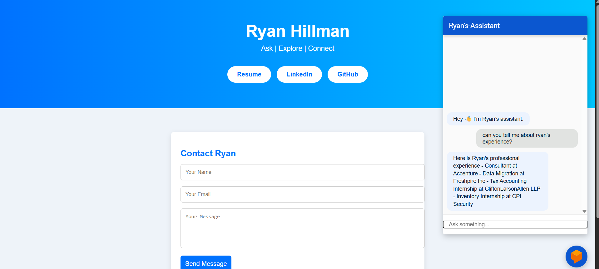

# 🤖 Ryan's Interactive Resume Chatbot

Welcome to my interactive resume project!  
This site demonstrates how I’ve used **Google Cloud Dialogflow ES**, **Cloud Run**, and **GitHub Pages** to create a chatbot that allows visitors to explore my professional background in a conversational way.

**Live Demo:** [Visit Chatbot Website](https://ryanhillman.github.io/ryan-dialogflow-bot/) 

**Simplified Resume (PDF):** [Download Resume](https://storage.googleapis.com/ryan-resume-bucket/resume.pdf)  

**LinkedIn:** [Ryan Hillman](https://www.linkedin.com/in/ryan-h-7614a2128/)

---

## 📷 Screenshot

---

## 💡 Features
- **Dialogflow ES Chatbot**: Handles intents like skills, programming languages, experience, certifications, education, and awards.  
- **Custom Webhook (Python/Flask on Cloud Run)**: Dynamically pulls information from my structured resume JSON stored in Google Cloud Storage.  
- **Website Integration**: Chatbot embedded directly on the site using Dialogflow Messenger.  
- **Contact Form**: Integrated with [Formspree](https://formspree.io) to allow easy email outreach.  

---

## ⚙️ Tech Stack
- **Frontend**: HTML5, CSS3, lightweight JavaScript  
- **Chatbot**: Google Dialogflow ES
- **Backend**: Google Cloud Run (Flask webhook service)  
- **Storage**: Google Cloud Storage (resume.json + resume.pdf)  
- **Deployment**: GitHub Pages for static site hosting  
- **Integrations**: Formspree for contact form handling  

---

## 🚀 How It Works
1. A user asks a question in the embedded Dialogflow Messenger widget.  
2. Dialogflow routes the intent to a webhook hosted on Cloud Run.  
3. The webhook retrieves structured data from `resume.json` in Cloud Storage.  
4. The bot responds with relevant details (skills, experience, etc.).  
5. Users can view my resume, LinkedIn, GitHub, or contact me directly via the form.  

---

## 📌 Why This Project?
This project showcases my ability to:
- Build and deploy cloud-based conversational AI solutions.  
- Integrate multiple Google Cloud services into a seamless system.  
- Create user-facing projects that highlight both technical and communication skills.  

---

## 📬 Contact
If you’d like to connect, feel free to reach out via the contact form on the site or through my LinkedIn.

